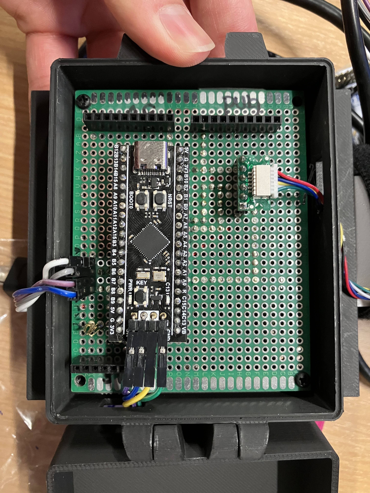
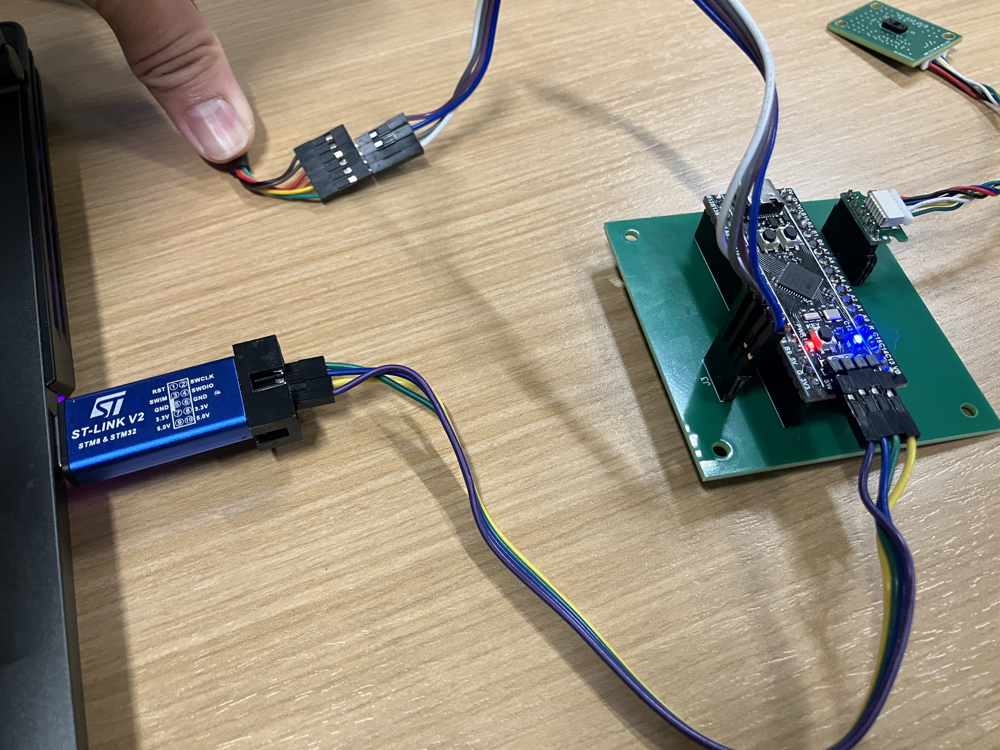
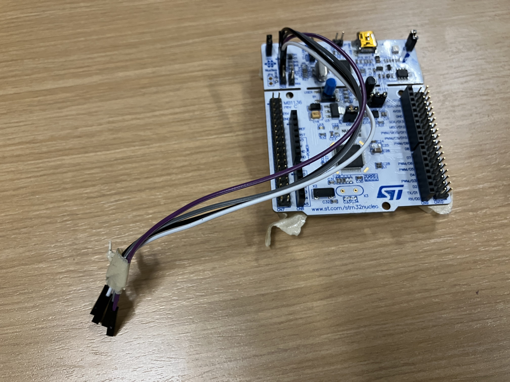

# VL53L8CH Firmware

Microcontroller firmware for the ST VL53L8CH miniature time-of-flight sensor. This firmware is based on the open source ["ULD" firmware](https://www.st.com/en/embedded-software/stsw-img043.html) provided by ST, with modifications to improve speed and add features. This firmware is required to utilize the [mini_tof ROS 2 package](https://github.com/uwgraphics/mini_tof).

# Hardware Setup
## Components
The provided firmware requires an ST F411 microcontroller connected to an ST VL53L8CH sensor. While other microcontrollers may be possible to use, there are limitations due to the amount of memory required by the firmware. If you believe another microcontroller can be used, and would like to contribute source code or instructions for that microcontroller, please open an issue or pull request.

There are multiple hardware versions of both the F411 and VL53L8CH.

The easiest to acquire is an off-the-shelf [F411 board](https://www.st.com/en/evaluation-tools/nucleo-f411re.html), along with the [VL53L8CH](https://www.st.com/en/ecosystems/satel-vl53l8.html) breakout board from ST. This setup is fully off-the-shelf but requires bulky breadboard wiring or custom soldering.

Another option is to use an off-brand miniature version of the F411 like the [Blackpill F411](https://www.adafruit.com/product/4877). This is the setup currently prefferred by the developers, but it has its own disadvantages - the Blackpill does not support sending data over the USB-C via FTDI, so it requires a separate FTDI-to-USB adapter. Additionally, the Blackpill requires a separate external flasher like an [STLink](https://www.st.com/en/development-tools/st-link-v2.html) to flash the board, while the off-the-shelf F411 has a flasher built in.

The authors have also created a custom PCB (left in the image below) for the VL53L8CH which connects to the microcontroller via a single 6-pin JST SH style cable. This custom PCB is much smaller than the breakout board from ST and includes through-holes for easy mounting. If you are interested in this custom PCB, [please reach out to the authors](mailto:sifferman@wisc.edu) - we can provide a link to order the pre-assembled custom boards directly from PCBWay.


## (Old) Breadboard Wiring Guide
Make the following connections between the F411 and VL53L8CH breakout board:
```
EXT_5V          <-> 5V
EXT 1V8             NC
EXT_3.3V            NC
EXT IOVDD           NC
PWR_EN          <-> D11
MCLK_SCL        <-> D3
MOSI_SDA        <-> D4
EXT MISO        <-> D5
NCS (I2C_RST)   <-> D10
EXT LPn         <-> 3V3
EXT SPI_I2C     <-> 3V3
GPIO1           <-> A2 (not used)
GPIO2               NC
GND             <-> GND
```

For convenience, wee below for the pinout of the SATEL-VL53L8 board, taken from the datasheet.


## Dedicated PCB Setup (Updated Hardware Information (After April 2025))

The VL53L8CH sensor and Blackpill F411 now have a dedicated PCB, which replaces the breadboard-style wiring shown earlier. We also have dedicated mounts for the PCB, sensor, and associated wiring which can be easily mounted on various robots, such as the end-effector of a UR5.

- **Old vs. new PCB**
  - The original custom PCB and wiring approach are shown here:
  
    

  - The current recommended dedicated PCB and wiring are shown here:
  
    

- **Blackpill orientation on the dedicated PCB**
  - **The Blackpill must be oriented correctly** when it is plugged into the dedicated PCB.
  - **J4 connector**: The `J4` connector on the PCB **must face away from the main board** (toward the outside edge), matching the orientation in `media/new_pcb_setup.jpg`.
  - **J3 header/pins**: The pins on the `J3` header must match the picture in `media/new_pcb_setup.jpg`. Double-check that each signal (e.g., `3V3`, `GND`, `SWDIO`, `SWCLK`, `TX`, `RX`) lines up with the labels on both the Blackpill and PCB silkscreen.

- **Connections to the ST-LINK USB stick**
  - The pins exiting the Blackpill are connected to the blue ST-LINK USB stick for **power and data transfer**. Match the pins based on the labels on both boards (e.g., `SWDIO`, `SWCLK`, `GND`, `3V3`, and any UART pins if used).
  - If the ST-LINK USB stick is **bricked**, it will still provide **power and data (USB-UART)** but **cannot be used to flash** the Blackpill firmware.

- **Using an STM32 Nucleo board when the ST-LINK stick cannot flash**
  - An STM32 Nucleo-64 board has a **built-in ST-LINK flasher/debugger** that can be used as a replacement to flash the Blackpill (see the example Nucleo board below).
  
    

  - In this case, follow **Section 7.4.5** and **Table 5** of the ST Nucleo-64 user manual (`UM1724`) for the exact pin connections between the Nucleo’s ST-LINK interface and the Blackpill, and for detailed flashing instructions:
    - [UM1724: STM32 Nucleo-64 boards (MB1136) user manual](https://www.st.com/resource/en/user_manual/um1724-stm32-nucleo64-boards-mb1136-stmicroelectronics.pdf)
  - Use these instructions **together with** the flashing steps described earlier in this README (see **"Flashing the Microcontroller"**) to build the `.BIN` firmware and flash it to the Blackpill via the Nucleo’s built-in ST-LINK.


# Software Setup

## MBed Studio
Install MBed Studio from the [Arm website](https://os.mbed.com/studio/). This is the IDE used to compile the firmware for the microcontroller.

## Compile the driver to binary
1. **Create an empty project in MBed Studio.**

    Navigate top right, File -> New Program. Under Example Program select "Empty Mbed OS Program". Name your program (e.g. "VL53L8CH"). Should look like [this](media/mbed_new_program.png).

2. **(For Blackpill) Set up the Blackpill F411RE Target**

    Right-click on the program's root folder and in the popup window select "Add library..."

    Paste the text https://os.mbed.com/users/hudakz/code/BLACKPILL_Custom_Target into the Git or os.mbed.com URL edit box. Click "next".

    Open the drop-list and select "default" as Branch or tag and click on the "finish" button.

    Open the `BLACKPILL_Custom_Target` folder and drag and drop the `TARGET_BLACKPILL_F411CE` folder and the `custom_targets.json` file one by one to the root folder of your program.

    Delete the `BLACKPILL_Custom_Target` folder from your project.

    Open the "Target" drop-list and click on the button with an icon that looks like a computer chip (Manage custom targets).

    Open the "USB device" drop-list and select your STM32 ST-Link programmer.

    Open the "Build target" drop-list and select BLACKPILL_F411CE.
    
3. **Move the driver code into your MBed project**

    Drag and drop the following files from the `firmware` folder in this repository into the root directory of your Mbed project:

    * VL53L8CH_LIB
    * src
    * inc
    * mbed_app.json

    Remove the `main.cpp` file from the root folder of your MBed project.

4. **Compile the driver to binary**

    Click the hammer icon to create the .BIN file that can be flashed to the microcontroller.

## Flashing the Microcontroller
1. Install the [STM32 Programmer](https://www.st.com/en/development-tools/stm32cubeprog.html).

2. Connect your STLink to your microcontroller.

3. Within the STM32 Programmer, select "ST-Link" as the connection mode and click "connect".

4. Click on the "Open File" tab and navigate to the .BIN file you compiled previously.

5. Click "Download" in STM32 Programmer to flash the microcontroller.

6. (Blackpill only) click the reset button on the microcontroller (labeled `NRST`).

## Verify operation

To test that the sensor is working correctly, try visualizing the data using examples/live_vis.py, for example:

```bash
python VL53L8CH/examples/live_vis.py -p /dev/ttyUSB0 -z 16
```

# Utilizing the data
If you are using ROS 2, we recommend that you utilize the [mini_tof ROS 2 package](https://github.com/uwgraphics/mini_tof), which handles converting measurements from the sensor to a ROS 2 topic.

If you would like lower-level access to data from the sensor, example python programs which read and decode the USB serial port data from the sensor are available in the "examples" subdirectory.

# Configuring the sensor
The sensor can be configured by modifying the `src/example12.cpp` file in the firmware, and re-building the project and re-flashing the sensor. The values on lines 84 and 95 can be modified. See the [[VL53L8CH datasheet](https://www.st.com/resource/en/datasheet/vl53l8ch.pdf)] for details on the allowed configurations.

In the future, we plan to add support for on-the-fly reconfiguration without re-flashing, and integrate this functionality into the mini_tof ROS 2 package. If you are interested in this feature, please open an issue or pull request.